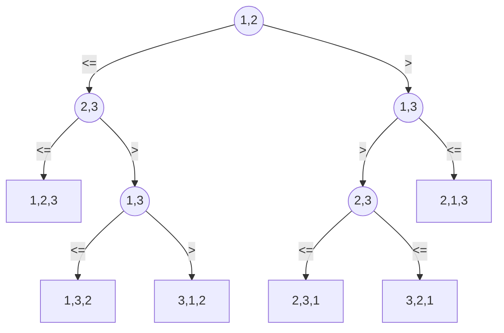

2023-02-13  


Arrivato alle 12:34 perso 19 min di lezione.


## Albero di Decisione

Per esempio ordino tre elementi <a1,a2,a3>

//albero da disegnare meglio//

![[photo_2023-02-13_12-36-59.jpg]]



ù

  
  
  
  
  
  
  
  
  
  

In generale per un input di dimensione n <a1,...an>

abbiamo due tipologie di nodo:

- Ogni nodo interno è etichettato da $i,j$ dove $i,j$ sono indici dei noistri elementi da orginare $i,j \in {1,...,n}$

a) Significa confronta $a_i \lor \leq a_j$

b) il sottoalbero sinistro da $i$ successivo confronta se $a_i \leq a_j$

c) il sottoalbero sinistro da $i$ successivo confronta se $a_i > a_j$

  

- Ogni foglia da una permutazione:

$<\pi(1), ... , \pi(n)>$ tale che $a_\pi(1) \leq a_\pi(2) \leq ... \leq a_\pi(n)$

  

//ma troppo veloce foto da integrare e correggere//

![[photo_2023-02-13_12-57-12.jpg]]

Dato un qualsiasi ordinamento per confronti

- Costruisco un albero di decisione per ogni n

- L'albero modella tutte le possibili tracce di esecuzione

- Tempo di esecuzione (#confront) è la lunghezza di un cammino nell'albero

- Tempo di esecuzione nel caso peggiore è l'altezza dell'albero

  

-> Un limite inferiore sulle altezze di tutti gli alberi di decisione dove ogni permutazione compare come foglia

  

Quante foglie ha l'albero di decisione?

Il numero di foglie è $\leq n!$ perchè per essere corretto ogni permutazione deve comparire almeno una volta.

  

##### Lemma:

Un albero binario di altezza $h$ ha al più $2^h$

_dimostrazione per induzione su h_

  

$h=0$ im albero che ha un solo nodo, la radice, che è anche l'unico foglia

  

$$

\begin{align}

f=1\leq2^0 = 1

\end{align}

$$

  

Assumiamo che per alberi binari di altezza $K<h£ il numero di foglie è $\leq 2^k$ e lo dimostro per h.

  
  
  

Sia n la radice dell'albero $T$ di altezza $h$. Se $T$ ha un solo figlio allora il numero di foglia di $T$ è uguale al numero di foglie dell'albero $T1$ (Il suo unico figlio)

![[photo_2023-02-13_13-00-01.jpg]]

  

Sia n la radice dell'albero e ha due foglie

Allora il numero di ?? foglia di $T$ è uguale alla somma delle foglie di $T1$ e $T2$. Poiché $T1$ ha altezza $h1<h$ e $T2$ ha altezza $h2<h$ applico l'ipotesi induttiva $f1 \leq 2^{h1}$ e $f2 \leq 2^{h2}$

  
  

___

  

**Teorema:** Qualsiasi algoritmo di ordinamento per confronti richiede $\Omega (n \log n)$ confronti nel caso peggiore.

  

_Dimostrazione:_ Bisogna determinare l'altezza di un albero di decisione dove ogni permutazione appare come foglia.

Si consideri un albero di decisione con tale caratteristica di altezza $h$ con $l$ foglie che corrispondono a un ordinamento per confronti di $n$ elementi. Allora $l \geq n!$

$$

\begin{align}

n! \leq l \leq 2^h \\

h \geq \log n!

\end{align}

$$

$$ n! \cong \sqrt{2 \pi n} \qquad(\frac{n}{l})^n (1+\Uptheta \frac{1}{n}) $$

  

Corollario: Heaposort e MergeSort sono algoritmi di ordinamento per confronti asintoticamente ottimale. I limiti superiori $O(n \log n)$ sui tempi di esecuzione per

  
  
  

# Ordinamenti Lineari:

  

### Counting Sort:

_Assunzione:_ I numeri da ordinare sono interi in un intervallo che va da 0 a $k$, per qualche intero $k$.

  

__Input:__ $A[1...n]$ dove $A[j] \in [o...k]$ $n$ e $k$ sono parametri

__Output:__ $B[1...n]$, ordinati i valori sono un permutazione di $A$

  

_Memoria Ausiliare:_ $C[0...k]$

  

```F#

//k è il valore più grande che può assumere il mio vettore A

countingsort(array A, array B, int n, int k)

creo C[0....k]

for i = 0 to k

c[i] = 0

for j = 1 to n

c[ A[j] ]++

for i = 1 to K //somme prefisse

c[i] = c[i] + c[i-1]

for j = n downto 1

B[C[A[j]] ] = A[j]

C[A[j]]--

```

  

Il tempo di esecuzione del counting_sort è di: $\Theta(n+k)$

_Il counting_sort è utilizzato quando $k=O(n)$ nel qual caso il tempo di esecuzione è lineare $\Theta(n)$ _

2023-02-14

## Counting sort

> **Lemma**
> dati n numeri di $d$ cifre dove ogni cifra può avere fino a $k$ valori, la procedura *radix_sort* correttamente ordina i numeri nel tempo $\Theta (d(n+k))$ se l'ordinamento stabile che viene utilizzato dalla procedura impiega un tempo $\Theta(n+k)$.

Se $k= O(n)$, tempo di esecuzione è $\Theta(dn)$ e $d$ è costante -> $\Theta(n)$


Abbiamo n interi e ciascuno è rappresentato da b bit
spezzare ogni intero in $\lceil \frac{b}{r}\rceil$ cifre ognuna costituita da r bit e al massimo possibile d valori di ciascuna cifra $k=2^r$.
Il tempo di esecuzione del radix_sort : $\Theta(\frac{b}{r}(n+2^{r}))$
Dati i valori e n e b, scegliamo il valore di r, con $r leq b$, che renda minima $\cfrac{b}{r}(n+2^{r})$
Se $b < \log n$ allora per qualunque valore $r \leq b$ si ha $(n+2^{r}) = \Theta(n)$. Quindi, scegliendo $r=b$, si ottiene un tempo di esecuzione $\cfrac{b}{b}(n + 2^{r})$.
Se $b \geq \lfloor \log{n} \rfloor$ scelgo r tale che sia massimo ma sotto la condizione che $n \geq 2^r -> r = \lfloor \log n \rfloor$.

**Esercizio**: dimostrare come ordinare n numeri interi compresi nell'intervallo da 0 a $n^4 - 1$ nel tempo O(n) in modo non crescente.

no counting sort perché c'è n^4 $\Theta(n+n^4) = \Theta(n^4)$ quindi no.
Utilizzo il radix_sort perché $\Theta(d(n+k))$ dove $k=O(n)$
$\log_{4}n^{4} = 4 \qquad k=n \qquad d=4 \qquad 0...n^{c}-1 \quad \text{dove c è una costante}$


```python
def radix_sort(int A[], int n):
	for i to 4
		counting_sort(A, n, A[i]) %%Theta(n)%%

def counting_sort(int A[], int n, int i):
	alloco un vettore B[1..n]
	alloco un vettore C delle occorrenze C[0...n-1]
	for j=0 to n-1:
		C[j] = 0
	for i=1 to n:
		C[cifra(A[i],n,i)]++
	for j=n-2 downto 0:
		C[j] = C[j] + C[j+1]
	for j=n downto 1:
		B[C[cifra(A[j],n,i)]] = A[j]
		C[cifra(A[j], n,i)]--
	copia vettore B in A

def cifra(int x, int n, int i):
	return mod(x/n^(i-1), n)
```

Complessità: $\Theta(n)$